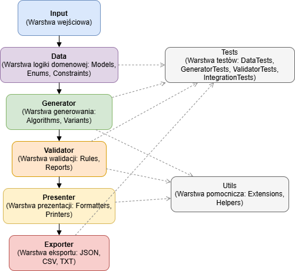

# IO5Plan

<p align="center">
  
</p>


**Generator planów zajęć lekcyjnych**  
(projekt na bardzo wczesnym etapie rozwoju)

Inteligentna aplikacja pomagająca w automatycznym układaniu planów lekcji dla szkół.

Obecna wersja: **konsolowa** 

## Cel projektu

Umożliwić szybkie wygenerowanie kilku sensownych wariantów planu lekcji przy podaniu:

- liczby godzin do ułożenia w tygodniu dla danego typu zajęć
- dostępności nauczycieli w poszczególnych dniach tygodnia
- (w przyszłości) dodatkowych ograniczeń i preferencji

## Stan projektu

- [ ] podstawowy model danych (lekcje, nauczyciele, dni, sale)
- [ ] wczytywanie danych wejściowych z pliku
- [ ] prosty generator losujący plan zgodne z danymi 
- [ ] prezentacja kilku wariantów planu w czytelnej formie tekstowej
- [ ] walidacja poprawności wygenerowanego planu
- [ ] eksport planu do pliku (txt, csv, json, htm?)


## Wymagania funkcjonalne MVP

1. Użytkownik podaje liczbę godzin lekcyjnych danego typu zajęcia w tygodniu
2. Użytkownik definiuje listę nauczycieli i ich dostępność (dni + ewentualnie godziny)
3. Aplikacja generuje co najmniej 3–5 różnych, poprawnych planów lekcji dla jednej klasy
4. Każdy plan pokazuje rozkład godzin dla każdego dnia tygodnia
5. Walidacja – żaden nauczyciel nie prowadzi dwóch lekcji jednocześnie
6. Możliwość zapisu wybranego planu do pliku tekstowego / JSON

## Wymagania niefunkcjonalne (stan na początek projektu)

| Aspekt               | Oczekiwanie na MVP                          | Docelowo (graficzna wersja)              |
|----------------------|----------------------------------------------|--------------------------------------------|
| Język                | C# .NET 9                                    | C# .NET 9                                 |
| Typ aplikacji        | konsolowa                                   | desktop Avalonia                           |
| Interfejs wejścia    | konsola + ewentualnie plik JSON/YAML/txt    | GUI             |
| Czas generowania     | < 10 sekund na 20–30 lekcji (pierwsza wersja) | < 3–5 sekund na klasę                     |
| Liczba wariantów     | 3–10 sensownych planów                      | 5–30 wariantów z możliwością filtrowania  |
| Wielkość danych      | ~40 godzin w tygodniu         | wiele oddziałów, pełna szkoła             |


## Planowane etapy rozwoju (wstępna roadmap'a)
1. Obsługa sal
2. Najprostszy generator losujący + podstawowa walidacja kolizji nauczycieli
3. Wyświetlanie czytelnego planu w konsoli (tabela tekstowa) i zapis do wybranego pliku
4. Zapisywanie planu do pliku
5. Dodanie prostych ograniczeń (np. maksymalnie 2 matematyki dziennie)
6. Pierwsza wersja graficzna Avalonia

## Funkcjonalności / moduły systemu
- **Wczytywanie danych**: Wczytywanie danych o nauczycielach, typach zajęć oraz dostępności z plików.
- **Generator planów lekcji**: Algorytm do generowania różnych planów lekcji na podstawie wczytanych danych.
- **Walidacja planu**: Zapewnienie poprawności planu, aby żaden nauczyciel nie prowadził dwóch lekcji jednocześnie.
- **Prezentacja wyników**: Wyświetlanie wygenerowanych planów w czytelnej formie tekstowej oraz możliwość ich zapisu do plików.
- **Eksport danych**: Zapisanie wybranego planu lekcji w różnych formatach plików (txt, csv, json).

## Przypadki użycia
1. Użytkownik podaje liczbę godzin zajęć i dostępność nauczycieli → aplikacja generuje poprawne plany lekcji
2. Użytkownik przegląda kilka wariantów planu i wybiera najdogodniejszy
3. Użytkownik zapisuje wybrany plan do pliku (np. JSON lub CSV)
4. (Docelowo) Użytkownik filtruje plany według preferencji lub ograniczeń

## Architektura systemu



## Stos technologiczny
- **Język**: C# (.NET 9)  
- **Typ aplikacji**: Konsolowa (MVP), docelowo Avalonia GUI  
- **Format danych**: JSON / TXT / CSV  
- **IDE**: Visual Studio  
- **Repozytorium**: GitHub  

## Proces uruchomienia projektu

1. Sklonuj repozytorium:
```bash
git clone https://github.com/twoj-repo/IO5Plan.git
```
2. Otwórz projekt w Visual Studio
3. Uruchom aplikację (projekt konsolowy)
4. Wprowadź dane ręcznie lub załaduj z pliku
5. Otrzymasz kilka wariantów planu lekcji w konsoli
6. Wybierz i zapisz plan do pliku

## Struktura folderów
```text
IO5Plan/
├── Data/                                   # modele danych i logika domenowa
│   ├── Models/                             # klasy opisujące elementy planu (Lekcja, Nauczyciel, Sala, Klasa, Slot czasowy)
│   ├── Enums/                              # typy wyliczeniowe (Dni tygodnia, Typ zajęć)
│   └── Constraints/                        # ograniczenia i reguły domenowe (dostępność nauczycieli, limity godzin)
├── Input/                                  # moduły do wczytywania danych
├── Generator/                              # logika generowania planów lekcji                      
├── Validator/                              # walidacja poprawności planów                       
├── Presenter/                              # prezentacja planu w konsoli
│   ├── Formatters/                         # formatowanie danych do tabel
│   └── Printers/                           # drukowanie planu
├── Exporter/                               # eksport planów do plików
├── Utils/                                  # funkcje pomocnicze
│   ├── Extensions/                         # metody rozszerzające
│   └── Helpers/                            # narzędzia ogólne
├── Tests/                                  # testy jednostkowe
├── Examples/                               # przykładowe dane wejściowe i wyjściowe
│   ├── InputSamples/                       # przykładowe pliki wejściowe
│   └── OutputSamples/                      # przykładowe wygenerowane plany
├── Docs/                                   # grafiki, logo, architektura systemu
├── Program.cs                              # punkt startowy aplikacji konsolowej
└── README.md                               # dokumentacja projektu
```
